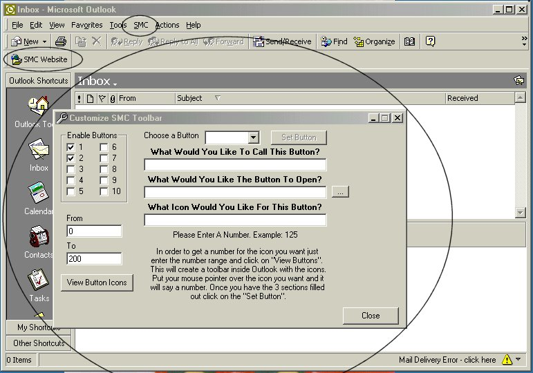



## Outlook 2000 Add\-IN

### Description

This is an Add-In for Outlook 2000 that allows you to add your own buttons to it's toolbars. You can specify the what button to use, and what program, file, or URL the button will open.

It has a Password feature any many more things you will have to see.

IMPORTANT:. To get this to work you YOU MUST: 1) Have Outlook 2000 installed on your machine, 2) Register the SMC_Outlook2000.dll using regsvr32.dll, 3) Run the RegSettings.reg file, and 4 (optionally, to customize the add-in to your liking) run the settings.exe file, the code for which is also provided.

VB 6 Service Pack 4 is what I used to code this.

SORRY for the poor documentaion and code comments.

I am VERY busy. If you need any help Please email me. scroft@columbus.rr.com
 
### More Info
 

             |
---                |---
**Submitted On**   |2000-11-03 11:42:38
**By**             |[Shane Croft](https://github.com/Planet-Source-Code/PSCIndex/blob/master/ByAuthor/shane-croft.md)
**Level**          |Advanced
**User Rating**    |4.9 (34 globes from 7 users)
**Compatibility**  |VB 6\.0
**Category**       |[Complete Applications](https://github.com/Planet-Source-Code/PSCIndex/blob/master/ByCategory/complete-applications__1-27.md)
**World**          |[Visual Basic](https://github.com/Planet-Source-Code/PSCIndex/blob/master/ByWorld/visual-basic.md)
**Archive File**   |[CODE\_UPLOAD112651132000\.zip](https://github.com/Planet-Source-Code/shane-croft-outlook-2000-add-in__1-12507/archive/master.zip)

